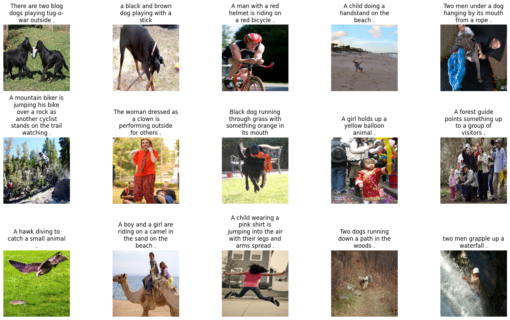
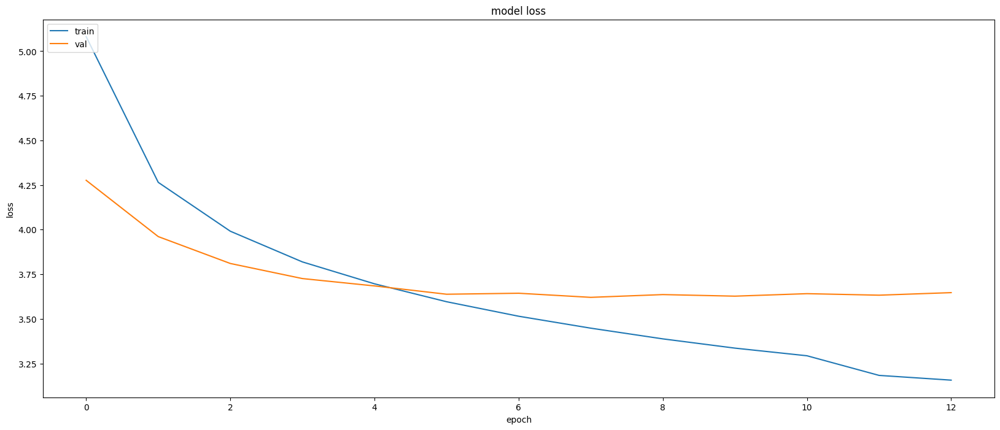
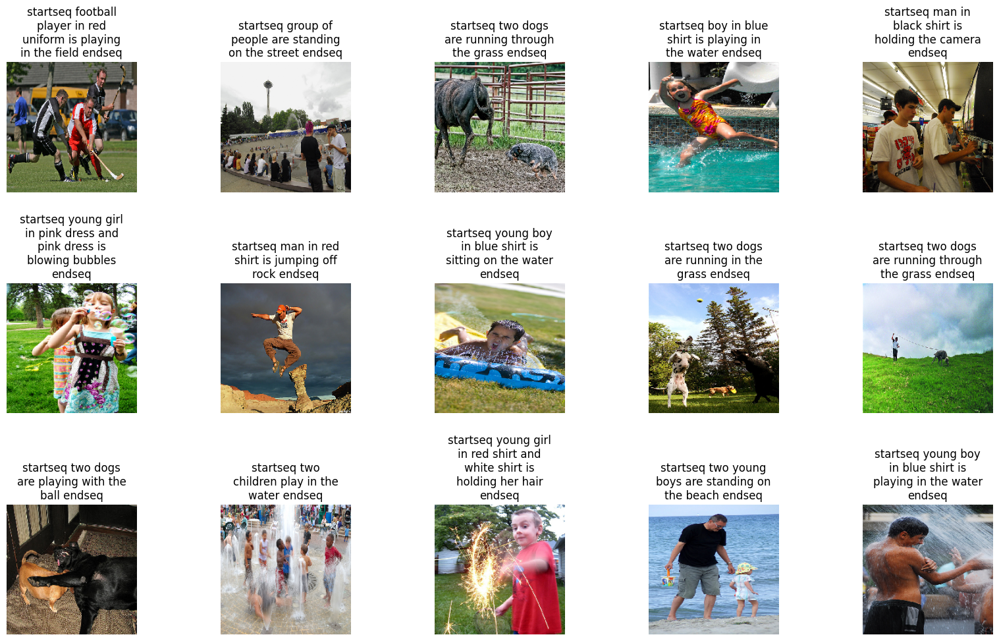

# Senior Project: Image Captioning Tool

## 1. Introduction

The rapid advancement of artificial intelligence has unlocked exciting possibilities in the realm of computer vision, enabling machines to "see" and interpret images in ways that were previously unimaginable. This project delves into the fascinating field of image captioning, aiming to develop a sophisticated tool that can automatically generate accurate and descriptive captions for images. This capability has far-reaching implications, from assisting visually impaired individuals in understanding visual content to automating image tagging for massive datasets and even generating creative captions for social media posts.

This project leverages the power of deep learning, specifically Convolutional Neural Networks (CNNs) and Long Short-Term Memory (LSTM) networks, to build an image captioning model. The model will be trained on the Flickr8k dataset, a rich collection of images paired with human-written captions, enabling it to learn the complex relationship between visual features and textual descriptions.

## 2. Project Methodology

The project follows a structured methodology, encompassing several key stages:

### 2.1 Data Preparation

The foundation of any successful machine learning project lies in the quality of the data. Therefore, meticulous data preparation is essential. This involves:

* **Data Cleaning**: The Flickr8k dataset is carefully examined to identify and rectify any inconsistencies or errors. This includes removing duplicate entries, handling missing captions, and ensuring the validity of image paths.
* **Text Preprocessing**: The captions are transformed into a format suitable for model training. This includes converting text to lowercase, removing punctuation and special characters, and adding special tokens to mark the beginning and end of each caption. This preprocessing step ensures that the model receives clean and consistent textual input.

### 2.2 Feature Extraction

To enable the model to "understand" the visual content of images, a pre-trained CNN called DenseNet201 is employed. This powerful CNN has been trained on a massive dataset of images and has learned to extract meaningful features from images, such as edges, textures, and objects. By utilizing DenseNet201, the project benefits from transfer learning, leveraging the knowledge already embedded in the CNN to accelerate the training process and improve performance. The extracted features serve as a rich representation of the image content and are fed as input to the caption generation model.

### 2.3 Caption Generation

The heart of the image captioning system lies in the caption generation model. This model ingeniously combines the extracted image features with textual information to generate descriptive captions. The architecture of choice for this task is a Long Short-Term Memory (LSTM) network, a type of recurrent neural network renowned for its ability to process sequential data, such as text. The LSTM network learns to generate captions by predicting the next word in a sequence, given the preceding words and the visual context provided by the image features. This process mimics how humans generate language, building a sentence word by word, taking into account both the preceding context and the visual scene.

### 2.4 Model Training and Evaluation

The image captioning model is trained on the meticulously prepared Flickr8k dataset using a supervised learning approach. During training, the model learns to map image features to corresponding captions by minimizing a loss function that quantifies the discrepancy between predicted and actual captions. This iterative process allows the model to fine-tune its parameters and improve its caption generation capabilities.

Once trained, the model's performance is rigorously evaluated using appropriate metrics, such as BLEU score. BLEU (Bilingual Evaluation Understudy) is a widely used metric in natural language processing that assesses the similarity between generated captions and human-written reference captions. By comparing the model's output to human-generated captions, BLEU provides a quantitative measure of the model's accuracy and fluency.

## 3. Example of Image-Caption Pairing

To illustrate the nature of the data used in this project, consider the following image and its associated captions:

**Captions:**

* There are two blog dogs playing tug-o-war outside.
* A black and brown dog playing with a stick.
* A man with a red helmet is riding on a red bicycle.
* A child doing a handstand on the beach.
* Two men under a dog hanging by its mouth from a rope.
* A mountain biker is jumping his bike over a rock as another cyclist stands on the trail watching.
* The woman dressed as a clown is performing outside for others.
* Black dog running through grass with something orange in its mouth.
* A girl holds up a yellow balloon animal.
* A forest guide points something up to a group of visitors.
* A boy and a girl are riding on a camel in the sand on the beach.
* A child wearing a pink shirt is jumping into the air with their legs and arms spread.
* A hawk diving to catch a small animal.
* Two dogs running down a path in the woods.
* Two men grapple up a waterfall.

This example showcases the diversity of captions and the level of detail that the model is expected to learn.

## 4. Model Training Visualization

The training process of the model can be visualized through loss curves, which show how the model's performance improves over epochs. Here is a graph that shows the training and validation loss during model training:

This graph illustrates the decrease in loss over epochs for both the training and validation datasets, indicating that the model is learning effectively.

## 5. Model Captioning Results

To demonstrate the model's captioning capabilities, here are some generated captions for sample images from the test set:

**Generated Captions:**

* startseq football player in red uniform is playing in the field endseq
* startseq group of people are standing on the street endseq
* startseq two dogs are running through the grass endseq
* startseq boy in blue shirt is playing in the water endseq
* startseq man in black shirt is holding the camera endseq
* startseq young girl in pink dress and pink dress is blowing bubbles endseq
* startseq young boy in blue shirt is sitting on the water. endseq
* startseq man in red shirt is jumping off rock endseq
* startseq two dogs are running in the grass endseq
* startseq two dogs are running through the grass endseq
* startseq young girl in red shirt and white shirt is holding her hair endseq
* startseq young boy in blue shirt is playing in the water endseq
* startseq two dogs are playing with the ball endseq
* startseq two children play in the water endseq
* startseq two young boys are standing on the beach endseq

These captions highlight the model's ability to capture key objects and actions within the images.

## 6. Project Deliverables

The culmination of this project results in several key deliverables:

* **Cleaned Dataset**: A meticulously organized and preprocessed version of the Flickr8k dataset, ready for model training and further research.
* **Trained Model**: A robust and accurate image captioning model capable of generating descriptive captions for a wide range of images.
* **Performance Metrics**: A comprehensive evaluation of the model's performance using relevant metrics, providing insights into its strengths and areas for potential improvement.
* **Interactive Demo**: A user-friendly interface that allows users to upload images and generate captions in real-time, showcasing the practical application of the developed tool.
* **Visualizations**: Illustrative visualizations that elucidate the model's architecture, attention mechanisms, and decision-making process, enhancing understanding and interpretability.
* **Technical Report**: A detailed report documenting the project methodology, results, and analysis, serving as a valuable resource for future research and development.

## 7. Conclusion

This project embarks on a journey to develop a practical and valuable image captioning tool by harnessing the power of advanced machine learning techniques. The resulting tool has the potential to empower visually impaired individuals, automate tedious image tagging tasks, and even inspire creative expression in social media. By seamlessly integrating CNNs for image feature extraction and LSTMs for caption generation, this project strives to bridge the gap between visual and textual data, enabling computers to perceive and describe the visual world in a manner akin to humans. The insights gained from this project contribute to the ever-evolving field of artificial intelligence, paving the way for future innovations in image understanding and human-computer interaction.